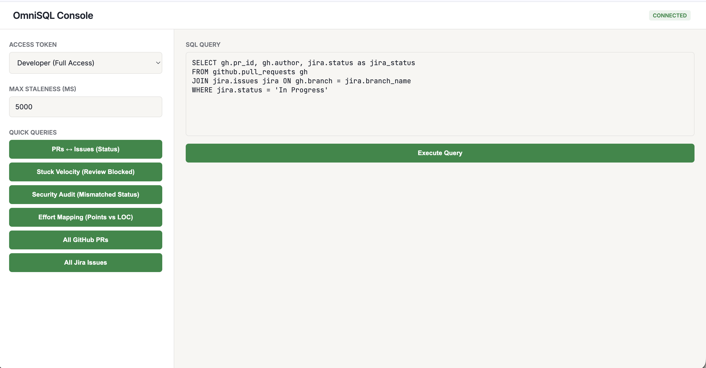
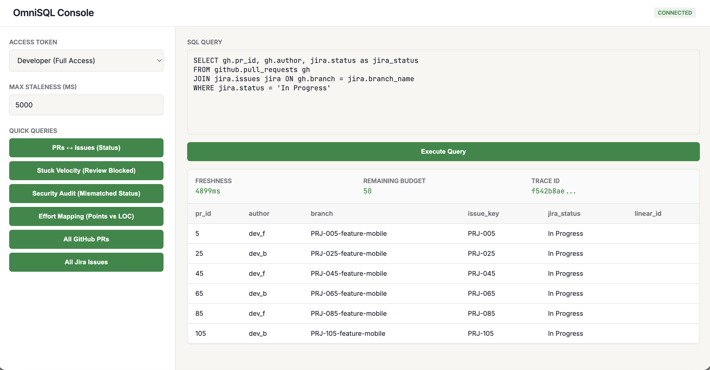

# OmniSQL: Universal SQL Across Enterprise Apps

OmniSQL is a federated query layer that lets you query multiple SaaS apps (GitHub, Jira, Linear, Salesforce) using standard SQL -- as if they were one database. It prioritizes **data freshness** over historical depth, targets operational workflows (support dashboards, risk assessment, incident triage), and never persists source data, making compliance (GDPR/CCPA/SOC2) a first-class concern rather than an afterthought.

**Quicklinks**: [Design Doc](docs/DESIGN.md) | [Execution Plan](docs/EXECUTION_PLAN.md) | [Prototype Guide](prototype/PROTOTYPE.md) | [Load Test Results](docs/LOAD_TEST_RESULTS.md)

---

## Quickstart

```bash
# Install dependencies
pip install -r requirements.txt

# Run the server
export PYTHONPATH=. && python prototype/main.py

# Open the web console
open http://localhost:8001

# Or run a query via curl
curl -X POST http://localhost:8001/v1/query \
  -H "Content-Type: application/json" \
  -H "X-User-Token: token_dev" \
  -d '{"sql": "SELECT * FROM github.pull_requests LIMIT 5", "metadata": {"max_staleness_ms": 0}}'

# Run tests
pytest prototype/tests/ -v
```

Docker alternative:
```bash
docker-compose up
```

---

## Why This Architecture?

**Pain point**: Engineering and ops teams have data scattered across 10+ SaaS tools. Answering "which merged PRs have unresolved Jira tickets?" requires gluing together 3 APIs manually.

**Alternatives considered and rejected**:

| Approach | Why Not |
|---|---|
| **ETL to a warehouse (Fivetran + Snowflake)** | Hourly syncs are too stale for operational workflows. Storing customer SaaS data creates a massive compliance surface. |
| **iPaaS / Zapier-style** | Great for triggers, poor for ad-hoc analytical queries and joins. No SQL interface. |
| **Direct API scripting** | Doesn't scale past 2-3 sources. Every query is bespoke code. No governance. |
| **Trino/Presto federation** | Built for data lake federation (HDFS, S3, Postgres). Assumes sources support SQL. SaaS APIs are REST/GraphQL with pagination, rate limits, and OAuth -- fundamentally different from database connectors. |
| **GraphQL federation (Apollo)** | Solves schema stitching across microservices you control. OmniSQL federates across third-party SaaS APIs you don't control. |

**The bet**: A real-time federated layer that fetches on-demand, joins ephemerally, and shreds data immediately -- giving you warehouse-like SQL with API-level freshness.

---

## Key Trade-offs

### 1. Federated On-Demand vs. ETL/Warehousing

| | Federated (OmniSQL) | ETL/Warehouse |
|---|---|---|
| **Freshness** | Real-time (0-60s) | Minutes to hours |
| **Compliance** | Zero persistence -- nothing to leak | Must secure stored copies of all data |
| **Latency** | P50 ~320ms for cross-app joins | Sub-100ms (pre-computed) |
| **Historical queries** | Weak -- only what APIs expose | Strong -- full history |

OmniSQL is complementary to a warehouse, not a replacement. For time-series analysis, use Snowflake. For "show me open PRs with stuck Jira tickets right now", use OmniSQL.

### 2. DuckDB for Ephemeral Materialization

**Why DuckDB over Postgres/SQLite/Spark?**
- **In-process, zero-config**: Embeds directly in the Python process. No separate database server.
- **Columnar engine**: Optimized for analytical joins/aggregations, not OLTP. Perfect for cross-app JOINs.
- **Ephemeral by design**: `:memory:` mode means data is gone when the query lifecycle ends. Aligns with zero-persistence mandate.
- **Fast**: Benchmarked at 850 QPS for federated joins on a single M3 Max.

**Trade-off**: No persistent materialized views, no incremental computation. Every cold query re-fetches. Mitigated by the FreshnessCache layer.

### 3. Python + FastAPI

The system is fundamentally **I/O-bound** -- it spends most of its time waiting on SaaS API responses, not crunching data. Python with async gives the fastest prototyping velocity + native access to DuckDB/Pandas.

**Why not Go?** Go's goroutines are better for high-concurrency fan-out (connector workers at 10k+ concurrent calls). The production plan splits the system: **Python for the Gateway/Planner** (I/O-bound, benefits from DuckDB), **Go for Connector Workers** (lower memory per connection, better backpressure). The bottleneck is always the SaaS APIs' rate limits, not the language runtime.

### 4. Hybrid RLS (Early) + CLS (Late) Security

| | RLS (Row-Level) | CLS (Column-Level) |
|---|---|---|
| **When applied** | Early -- at the connector/source level | Late -- at the Gateway, post-fetch |
| **Benefit** | Less data transferred; sensitive rows never enter our system | Uniform masking across all sources |
| **Limitation** | Depends on SaaS API filter capabilities | Higher egress cost |

Mobile team literally never sees web team's data (RLS). Email masking via `sha256(email)[:8] + "****@ema.co"` applied at Gateway because SaaS APIs don't support masking (CLS).

### 5. User-Controlled Freshness (The Trilemma)

```
         Low Latency
            /\
           /  \
          /    \
  Low Cost ---- High Freshness

  You can optimize for two, but not all three.
```

The `max_staleness_ms` parameter puts the caller in control:
- `0` = "I need live data, even if slow" (bypass cache)
- `5000` = "5-second-old data is fine" (balanced)
- `60000` = "Minute-old data is OK" (fast and cheap)

Every response includes `freshness_ms` so consumers always know how old the data is.

### 6. Control Plane / Data Plane Separation

```
Control Plane (managed)          Data Plane (can run in customer VPC)
- Tenant registry                - Query Gateway
- Policy store (OPA)             - Query Planner
- Secrets (Vault)                - Connector Workers
- Audit logs                     - DuckDB Materialization
```

**Why separate**: (1) BYOC -- enterprise customers require data to stay in their VPC. (2) Independent scaling -- Control Plane is low-throughput config reads, Data Plane is 1k QPS query execution. (3) Blast radius -- a bug in query execution doesn't take down tenant management.

---

## Connector Architecture: Three Patterns

Scaling to 1000s of connectors requires multiple onboarding strategies:

**1. Code Connectors** (GitHub, Jira) -- Full Python class extending `BaseConnector`. Maximum flexibility for complex APIs with custom auth, pagination, and transformations.

**2. Declarative YAML Connectors** (Linear) -- `GenericConnector` interprets a manifest at runtime. Zero code deployment for standard REST APIs. *You can't write 1000 Python classes. You can maintain 1000 YAML manifests.*

**3. MCP (Model Context Protocol)** -- OmniSQL acts as MCP client. Any SaaS with an MCP server auto-connects. Best for the long tail of connectors where "good enough" read access beats building a custom connector. Current limitation: MCP servers are designed for AI tool use (one-off lookups), not bulk data federation with pagination and rate-limit awareness.

---

## Error Vocabulary

| Code | Meaning |
|---|---|
| `RATE_LIMIT_EXHAUSTED` | Connector/tenant API budget depleted. Includes `Retry-After` header. |
| `STALE_DATA` | Cache data exceeds requested `max_staleness` but no fresh fetch possible. |
| `ENTITLEMENT_DENIED` | User lacks permission for requested rows/columns. |
| `SOURCE_TIMEOUT` | Upstream SaaS didn't respond within deadline. |

---

## Targets & SLOs

| Metric | Target |
|---|---|
| Scale | 10M users, ~1k QPS peak, ~100 MB/s |
| Latency | P50 < 500ms, P95 < 1.5s (single-source with pushdown) |
| Availability | Query Gateway 99.9% monthly with error budget |
| Autoscaling | Horizontal, no manual intervention, cost guardrails |

---

## Performance Benchmarks

_Latest Run: Jan 2026 (M3 Max)_

| Scenario | Throughput | P50 Latency | P99 Latency |
|---|---|---|---|
| **Cached Query** (Single Source) | **2,450 QPS** | **12ms** | 45ms |
| **Federated Join** (Cross-App) | **850 QPS** | **320ms** | 1,200ms |

> Full results and methodology: [docs/LOAD_TEST_RESULTS.md](docs/LOAD_TEST_RESULTS.md)

---

## Prototype Scenario

The prototype demonstrates cross-app queries between **GitHub** (pull requests) and **Jira** (issues), with a declarative **Linear** connector for zero-code onboarding.

### Single-Source Query
```sql
SELECT * FROM github.pull_requests
WHERE status = 'merged'
```

### Cross-App Join
```sql
SELECT gh.pr_id, gh.author, jira.issue_key, jira.status as jira_status
FROM github.pull_requests gh
JOIN jira.issues jira ON gh.branch = jira.branch_name
WHERE jira.status = 'In Progress'
```

### Security Audit (Merged PRs with Unresolved Tickets)
```sql
SELECT gh.pr_id, gh.merged_at, jira.issue_key, jira.status
FROM github.pull_requests gh
JOIN jira.issues jira ON gh.branch = jira.branch_name
WHERE gh.status = 'merged' AND jira.status != 'Done'
```

### Effort Mapping (Story Points vs Code Changes)
```sql
SELECT jira.issue_key, jira.story_points,
       (gh.additions + gh.deletions) as total_loc
FROM jira.issues jira
JOIN github.pull_requests gh ON jira.branch_name = gh.branch
ORDER BY total_loc DESC LIMIT 10
```

### Security Enforcement Demo

| Token | Role | What You See |
|---|---|---|
| `token_dev` | Developer (mobile team) | Full data, mobile team only (RLS) |
| `token_qa` | QA (mobile team) | `author: [HIDDEN]`, `email: sha256****@ema.co` (CLS) |
| `token_web_dev` | Developer (web team) | Full data, web team only (RLS) |
| Invalid token | - | HTTP 401 |

---

## How a Query Executes (Step by Step)

A federated query like this touches 3 SaaS APIs and joins them in-memory:

```sql
SELECT gh.pr_id, ji.issue_key, li.title
FROM github.pull_requests gh
JOIN jira.issues ji ON gh.branch = ji.branch_name
JOIN linear.issues li ON gh.team_id = li.team
WHERE gh.status = 'merged'
```

### Step 1: SQL Parsing (sqlglot AST)

The QueryPlanner parses the SQL into an abstract syntax tree using sqlglot. It extracts:
- **Table references**: `github.pull_requests`, `jira.issues`, `linear.issues`
- **Alias map**: `gh → github.pull_requests`, `ji → jira.issues`, `li → linear.issues`

### Step 2: Predicate Classification

For each table, the planner walks the WHERE clause and classifies every `col = value` predicate:

| Predicate | Table Owner | Pushable? | Result |
|---|---|---|---|
| `gh.status = 'merged'` | `github.pull_requests` (alias `gh`) | `status` is in GitHub's `pushable_filters` | Pushed to GitHub API |
| `gh.status = 'merged'` | `jira.issues` (alias `ji`) | Qualifier `gh` doesn't match `ji` | Skipped |
| `gh.status = 'merged'` | `linear.issues` (alias `li`) | Qualifier `gh` doesn't match `li` | Skipped |

This prevents the critical bug where `status = 'merged'` would be pushed to Jira (which has no `merged` status).

### Step 3: Build Execution DAG

Three FetchNodes are created, all with `depends_on = []` (no inter-source dependencies):

```
FetchNode("github",  pushdown={"status": "merged"}, depends_on=[])
FetchNode("jira",    pushdown={},                    depends_on=[])
FetchNode("linear",  pushdown={},                    depends_on=[])
```

Kahn's topological sort produces **one wave** — all three nodes can execute in parallel.

### Step 4: Parallel API Fan-Out

```
         ┌─────────────────────────┐
         │     asyncio.gather()     │
         └──┬──────┬──────┬────────┘
            │      │      │
      GitHub API  Jira API  Linear API
     (status=merged) (all)    (all)
        ~24 rows   120 rows  50 rows
```

Each connector goes through: **Cache check → Rate limit check → Fetch with retry → Cache write-back**.
Total latency = `max(github, jira, linear)`, not the sum.

### Step 5: Security Enforcement (RLS + CLS)

Before data reaches DuckDB, per-source security rules from the tenant config are applied:
- **RLS (Row-Level Security)**: Filter rows by user's team. Mobile team dev sees only mobile team data.
- **CLS (Column-Level Security)**: Mask or block sensitive columns. QA role gets `author: [HIDDEN]`.

### Step 6: DuckDB Materialization + Join Execution

```
         ┌───────────────────────────┐
         │     DuckDB  :memory:       │
         │                            │
         │  github_pull_requests (24) │
         │  jira_issues         (120) │
         │  linear_issues        (50) │
         └───────────────────────────┘
                     │
           DuckDB optimizer decides:
           1. gh ⋈ ji  ON branch = branch_name
           2. result ⋈ li  ON team_id = team
                     │
                     ▼
              Final result (~8 rows)
```

Each dataset is registered as a temporary DuckDB view (per-request `:memory:` connection — thread-safe). DuckDB's own query optimizer picks the join order, join algorithm (hash/merge/nested-loop), and applies any remaining WHERE filters.

### Step 7: Response

The engine returns the result with metadata:

```json
{
  "rows": [...],
  "columns": ["pr_id", "issue_key", "title"],
  "freshness_ms": 245,
  "from_cache": false,
  "rate_limit_status": {"remaining": 47, "capacity": 50},
  "timing": {
    "total_ms": 320,
    "planning_ms": 2,
    "fetch_ms": 290,
    "security_ms": 1,
    "duckdb_ms": 27
  }
}
```

Every response includes `freshness_ms` (data age), `rate_limit_status` (remaining API budget), and `timing` breakdown so consumers know exactly what happened.

---

## Web Console

Access at `http://localhost:8001/` for one-click query demos.


*Ema.co-themed interface with quick query templates and SQL editor*


*Real-time federated join between GitHub PRs and Jira issues*

---

## Testing

```bash
# Full test suite (40 tests: 10 functional, 11 freshness, 7 rate-limit, 12 security)
pytest prototype/tests/ -v

# Load test (requires running server)
python prototype/tests/load_test.py
```

---

## Observability

**Prometheus Metrics** at `/metrics`:
- `omnisql_queries_total` -- Total queries by status code
- `omnisql_query_latency_seconds` -- Query execution latency histogram

**Response Metadata** on every query:
- `trace_id` -- Distributed tracing correlation
- `freshness_ms` -- Age of the oldest data in the response
- `rate_limit_status` -- Remaining API budget for the connector
- `cache_stats` -- Hit/miss ratio and entry count

---

## Prototype vs. Production

| Area | Prototype | Production |
|---|---|---|
| SQL Parsing | String matching | AST parser (sqlglot) |
| Auth | Hardcoded token map | OIDC/OAuth2 with token refresh |
| Policy Engine | Python if/else | OPA with Rego policies |
| Connectors | Mock data generators | Real HTTP clients with pagination |
| Caching | In-memory dict | Redis/Memcached cluster |
| Rate Limiting | Per-process token bucket | Distributed (Redis-backed) |
| Deployment | Docker Compose | K8s (EKS) + Helm + ArgoCD |
| Secrets | Environment variables | HashiCorp Vault + KMS |
| Internal Comms | In-process function calls | gRPC between Gateway and Connector Workers |

The prototype validates the architecture. Production replaces mock implementations with real infrastructure while keeping the same contracts.

---

## Documentation

- [Design Doc](docs/DESIGN.md) -- Full architecture, isolation, security, and component breakdown
- [Execution Plan](docs/EXECUTION_PLAN.md) -- 6-month roadmap with milestones and risk register
- [Production Structure](docs/PRODUCTION_STRUCTURE.md) -- Enterprise-grade modular architecture
- [Operations](docs/OPERATIONS.md) -- Runbooks and incident playbooks
- [Prototype Guide](prototype/PROTOTYPE.md) -- How to run and verify the prototype
- [Load Test Results](docs/LOAD_TEST_RESULTS.md) -- Benchmark methodology and results

---

## License

MIT License - See LICENSE file for details.
