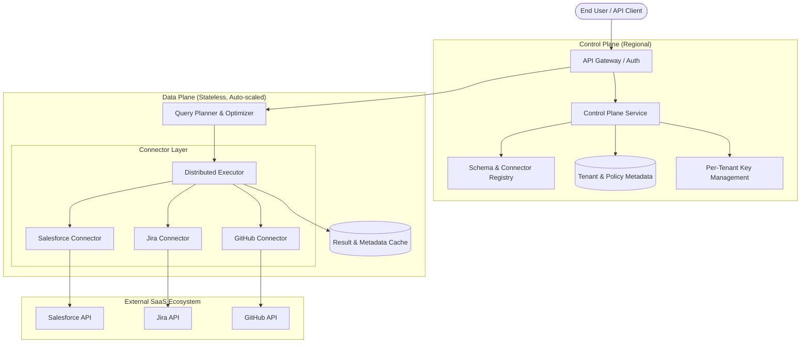

# OmniSQL: High-Level Design

## 1. Architecture Overview
OmniSQL follows a **Control Plane / Data Plane** separation to decouple management logic from high-throughput query execution.

### System Diagram

## 2. Component Breakdown
- **Control Plane**: Manages connector registries, tenant metadata, and encryption keys (per-tenant KMS integration).
- **Data Plane**: A stateless fleet handling SSL, SQL parsing (Query Planner), and parallel execution (Distributed Executor).
- **Connector Fleet**: Specialized gRPC adapters (Sidecar Model) that translate SQL predicates into SaaS-native filters (JQL, SOQL, etc.).

## 3. Multi-Tenant Isolation
OmniSQL utilizes **Logical Isolation with Physical Guards**:
- **At Rest**: Tenant credentials and cache are encrypted with unique per-tenant keys.
- **In Flight**: Every context is tagged with a `tenant_id`.
- **Compute**: Workers are pooled but resource-tracked per tenant. High-tier customers can use dedicated worker pools.

## 4. Security & Entitlements
- **Passthrough**: Uses the user's OAuth context to respect source system ACLs.
- **Synthetic Policies**: OPA-based query rewriting for service-account access (RLS/CLS).

## 5. Governance: Rate Limits & Freshness
- **Hierarchical Rate Limiting**: Distributed Token Buckets at Global, Tenant, and User levels.
- **Freshness Model**: Tiered caching (RAM, Redis) with TTLs and smart invalidation via webhooks.

## 6. Deployment Modes
- **Multi-tenant SaaS**: Managed high-scale shared infrastructure.
- **BYOC (Bring Your Own Cloud)**: Data plane runs in the customer's VPC; control plane remains managed.
