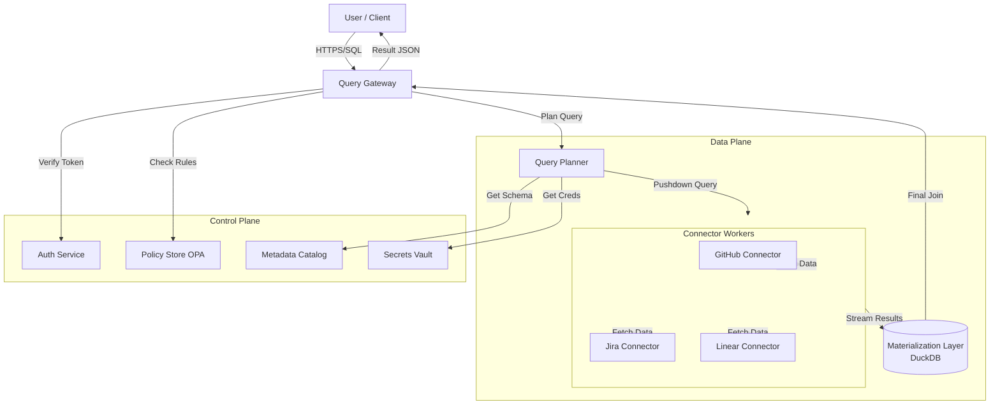
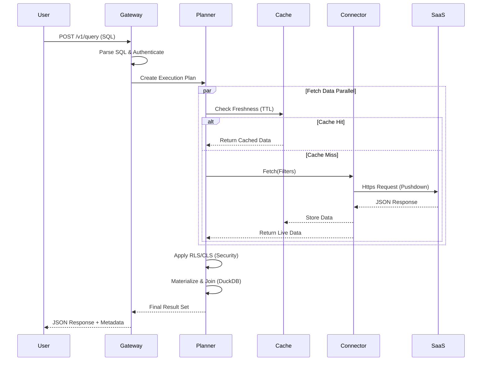

# OmniSQL: Technical Design Document

## 1. Core Architecture Concepts

OmniSQL is built as a cloud-native, federated query system with a strict separation of concerns.

### 1.1 Control Plane
The "Brain" of the system, responsible for governance and configuration.
- **Tenant & Connector Registry**: Management of customer accounts and available SaaS integrations.
- **Schema Catalog**: Centralized metadata about tables, fields, and operations supported by each connector.
- **Policy Store**: OPA-based definitions for RLS, CLS, and masking rules.
- **Secrets & Rate-Limit Policies**: Secure storage (Vault) and global/tenant-level budget definitions.
- **Audit Logging**: Immutable trail of every query and administrative action.

### 1.2 Data Plane
The "Engine" of the system, optimized for high-throughput, low-latency execution.
- **Query Gateway**: Entry point for all SQL requests.
- **Query Planner & Distributed Executor**: Parses SQL and orchestrates parallel data fetching.
- **Connector Workers**: Specialized sidecars that interface with SaaS APIs.
- **Materialization Layer**: Short-lived storage for complex joins and aggregations.
- **Async Job Runners**: Handles long-running queries that exceed synchronous timeouts.

### 1.3 Join & Execution Strategy
OmniSQL employs a hybrid execution model to balance performance, cost, and complexity:

| Strategy | Mechanism | Best For | Trade-offs |
| :--- | :--- | :--- | :--- |
| **Federated On-the-Fly** | Data is streamed from multiple sources and joined in-memory at the Gateway. | Small datasets, simple filters, low concurrency. | High Gateway memory usage; limited to "small-ish" joins. |
| **Short-Lived Materialization** | Parallel fetch → Spill to high-speed transient storage (DuckDB/S3) → Join → Shred. | Large-scale cross-app joins (e.g., millions of rows). | Transient I/O overhead; higher compute cost. |

#### Technical Rationale:
- **Zero-Persistence Guarantee**: Both strategies ensure data never enters a permanent warehouse. In "Short-Lived Materialization," the transient storage is ephemeral, encrypted with tenant-scoped keys, and wiped immediately post-query.
- **Predicate Pushdown**: We aggressively push filters (WHERE clauses) to the SaaS APIs to minimize data transfer for both strategies.
- **Materialization Trigger**: The Query Planner automatically switches to "Short-Lived Materialization" if the estimated intermediate result set exceeds the Gateway's safe memory threshold (e.g., > 100k rows).

### 1.4 Error Vocabulary
OmniSQL provides a standardized error model for developer clarity:
- `RATE_LIMIT_EXHAUSTED`: Source system or tenant budget has been exceeded.
- `STALE_DATA`: Federated query failed to meet the `max_staleness` constraint.
- `ENTITLEMENT_DENIED`: User lacks the necessary RLS/CLS permissions for the resource.
- `SOURCE_TIMEOUT`: A downstream SaaS provider exceeded the service SLO.
- `PLAN_FAILED`: Query planner could not optimize the federated request.

### 1.5 References
- **Connector Inspiration**: For a comprehensive list of SaaS categories and field mappings, refer to [Merge.dev Categories](https://merge.dev/categories).

---

## 2. Multi-Tenant Isolation & Security

### 2.1 Isolation Strategy
OmniSQL utilizes **Logical Isolation with Physical Guardrails**:
- **Namespace per Tenant**: Every tenant runs in a dedicated K8s namespace/logical boundary.
- **Network Boundaries**: Egress policies ensure no cross-tenant data leakage.
- **Encryption**: Data at rest (caches/materialization) is encrypted with **tenant-scoped keys** managed via Cloud KMS.
- **Sharding**: Compute resources are pooled into "Tiers," with an option for **Single-Tenant Clusters** for high-tier customers.

### 2.2 Security & Compliance
- **TLS & mTLS**: TLS 1.3 enforced everywhere; mTLS for all inter-service communication.
- **AuthN/AuthZ**: AuthN via OIDC; AuthZ via fine-grained OPA policies.
- **Data Residency**: Tags on data and jobs ensure compliance with regional residency requirements (GDPR, etc.).
- **Crypto-Shredding**: Org off-boarding triggers immediate deletion of tenant-scoped KMS keys and job cancellation.
- **Threat Model**: STRIDE analysis is applied to every component, with automated pentest readiness.

### 2.3 Cost Controls
To manage the economics of federated queries at scale, OmniSQL implements multi-layered cost controls:
- **Rate Limit as Cost Proxy**: Global and tenant-level token buckets act as a proxy for egress and operation costs.
- **Query Complexity Quotas**: The Query Optimizer estimates the cost (rows fetched/compute) before execution; expensive joins are rejected with `PLAN_FAILED`.
- **Cache-First Optimization**: High `max_staleness` values are encouraged via pricing or quotas to reduce expensive downstream SaaS calls.
- **Resource Limiting**: Compute for materialization (DuckDB) is capped per-tenant to prevent runaway resource consumption.

---

## 3. Detailed Component Breakdown

### 3.1 Architecture Diagram



### 3.2 Component Roles


| Component | Responsibility | Key Features |
| :--- | :--- | :--- |
| **Query Gateway** | Face of the System | AuthN (OIDC), AuthZ (Policy), request shaping, timeouts. Returns results + metadata (`freshness_ms`, `rate_limit_status`, `trace_id`). |
| **Query Planner** | Intelligence Layer | Capability discovery, predicate/column pushdown, join plan, cost/freshness hints, spill-to-materialization logic. |
| **Connector SDK** | SaaS Interface | Capability model (tables/fields/ops/limits), auth/token refresh, pagination, concurrency contracts, standardized error codes. |
| **Entitlement Svc** | Security Engine | Merges source permissions (e.g., GitHub Teams) with tenant-level policies to compute RLS/CLS at plan time. |
| **Rate-Limit Svc** | Governance | Token buckets/concurrency pools per connector/tenant/user; backoff and budget allocation; async overflow path. |
| **Freshness Layer** | Data Latency | TTL caches, conditional requests (ETag), incremental snapshots; per-source staleness contracts. |
| **Materialization** | Compute Layer | Short-lived tables (DuckDB/Parquet on S3) for massive joins; strictly transient lifecycle (TTL $\le$ N minutes); encrypted per tenant. |
| **Metadata Catalog** | Persistence | Postgres-backed store for schemas, policies, and tenant configurations; migrations via Flyway/Liquibase. |
| **Secrets & Keys** | Security Core | HashiCorp Vault + Cloud KMS (tenant-scoped keys); automated rotation and break-glass protocols. |
| **Observability** | Telemetry | OpenTelemetry traces, Prometheus metrics, structured logging; exemplar-linked dashboards and proactive alerts. |

### 3.3 Query Execution Flow



---

## 4. SQL & Policy Surface

OmniSQL provides a familiar SQL interface for developers while enforcing complex security and governance rules through a Policy DSL.

### 4.1 Supported SQL Subset (The "Safe" Surface)
To ensure performance and multi-tenant safety, OmniSQL exposes a curated subset of ANSI SQL:
- **Operations**: `SELECT`, `WHERE`, `LIMIT`, `ORDER BY`, `GROUP BY`.
- **Joins**: `INNER JOIN`, `LEFT JOIN` (between federated tables).
- **Projections**: Column aliasing, basic aggregations (`COUNT`, `SUM`, `AVG`).
- **Restrictions**: No `UPDATE/DELETE/INSERT`, no DDL (`CREATE/DROP`) via the query gateway.

### 4.2 Policy DSL (RLS/CLS)
Security policies are defined using a structured YAML DSL, which the **Entitlement Service** evaluates at runtime.

#### Row-Level Security (RLS)
Used to restrict which rows a user can see based on their identity or attributes.
```yaml
# Example: Team Isolation Policy
name: "github_team_isolation"
target: "github.pull_requests"
type: "RLS"
rule: "team_id = {{user.team_id}}"
```

#### Column-Level Security (CLS) & Masking
Used to hide or transform sensitive data in specific columns.
```yaml
# Example: PII Masking
name: "pii_masking"
target: "github.pull_requests"
type: "CLS"
actions:
  - column: "author_email"
    rule: "hash_hmac(val, 'secret_salt')"
  - column: "internal_notes"
    rule: "BLOCK" # Entirely removes the column from the result

#### Time-Based Access
Used to restrict access sensitive data to working hours.
```yaml
name: "working_hours_only"
target: "jira.issues"
type: "RLS"
rule: "now().hour >= 9 && now().hour <= 17"
```

#### Hierarchical Access
Managers can see all data for their department, while individual contributors only see their own team's data.
```yaml
name: "manager_hierarchy"
target: "github.pull_requests"
type: "RLS"
rule: "user.role == 'manager' ? team_id IN user.managed_teams : team_id == user.team_id"
```

#### Data Classification (CONFIDENTIAL)
Redact fields marked as CONFIDENTIAL for users without specific clearance.
```yaml
name: "confidential_data_redaction"
target: "linear.issues"
type: "CLS"
actions:
  - column: "financial_impact"
    rule: "user.clearance_level >= 'L3' ? val : 'REDACTED'"
```

#### Audit Trail Policy
Enforce that every query touching specific tables logs a reason code.
```yaml
name: "audit_requirement"
target: "all"
type: "AUDIT"
rule: "table == 'salaries' => require_metadata('audit_reason')"
```
```

### 4.3 Policy Compilation & Query Planning
Policies are not just "applied" to the final result; they are **compiled** into the query plan for efficiency.

1.  **Parsing**: The Query Gateway parses the incoming SQL.
2.  **Enrichment**: The Entitlement Service fetches all active policies for the user/tenant.
3.  **Compilation**:
    - **RLS Injection**: RLS filters are appended to the `WHERE` clause of the sub-queries sent to connectors. If the connector doesn't support the filter, it is applied during the materialization phase.
    - **CLS Transformation**: CLS rules are injected as `SELECT` transformations. A column marked `BLOCK` is removed from the internal projection, while masking rules are wrapped around the source column (e.g., `SELECT sha256(email) ...`).
4.  **Execution**: The final "Safe SQL" is executed against the materialized views in the Data Plane.

### 4.4 Interface: `POST /v1/query`
The primary interface for both multi-tenant and single-tenant modes.
- **Request Body**:
  ```json
  {
    "sql": "SELECT gh.pr_id FROM github.pull_requests gh JOIN jira.issues jira ON gh.branch = jira.branch_name",
    "metadata": { "trace_id": "abc-123", "max_staleness_ms": 5000 }
  }
  ```
- **Response Body**:
  ```json
  {
    "rows": [...],
    "columns": ["pr_id"],
    "freshness_ms": 124,
    "rate_limit_status": { "remaining": 95, "reset_ms": 60000 },
    "trace_id": "abc-123"
  }
  ```

---

## 5. Capacity & Performance Targets

### 5.1 Sizing & Scaling (1k QPS)
- **Concurrency**: 500 concurrent workers for 1k QPS with 500ms P50 latency.
- **Observability**: Prometheus metrics for `query_latency_seconds` and `connector_errors_total`. Traces covering the full lifecycle (Gateway -> Planner -> Connector).
- **Chaos Plan**: Automated failure injection for connectors; circuit breakers (Hystrix/Resilience4j style) to prevent cascading failures.

---

## 6. Deployment & Operations

- **IaC**: Terraform for VPC, EKS, Vault, RDS.
- **CD**: Helm, Canary/Blue-Green with automatic rollback on SLO (latency/error) regression.
- **Security Protocols**: TLS 1.3 everywhere; mTLS between microservices; per-tenant KMS keys for at-rest encryption.
- **DR/BCP Goals**:
  - **RPO (Recovery Point Objective)**: < 5 minutes for metadata/cache configuration.
  - **RTO (Recovery Time Objective)**: < 15 minutes for Data Plane failover to secondary region.
- **Operational Readiness**: See [OPERATIONS.md](OPERATIONS.md) for detailed Runbooks and deployment strategies.

---

## 7. Zero-Code Connector Onboarding

To avoid the overhead of writing and deploying new code for every SaaS integration, OmniSQL supports two advanced patterns for rapid onboarding.

### 7.1 Declarative API Mapping (YAML)
Instead of a Python/Go class, a developer provides a YAML manifest that defines the mapping between a REST/GraphQL API and the OmniSQL schema.

**Example `connector.yaml`**:
```yaml
id: "linear_app"
base_url: "https://api.linear.app/v1"
auth:
  type: "bearer"
  token_ref: "vault://secrets/linear/token"
tables:
  - name: "issues"
    endpoint: "/issues"
    method: "GET"
    selector: "$.data.nodes"
    columns:
      id: "$.id"
      title: "$.title"
      status: "$.status.name"
      assigned_to: "$.assignee.name"
```
A **Universal API Connector** in the Data Plane ingests this YAML and dynamically generates the fetch logic, pagination, and rate-limiting.

### 7.2 MCP (Model Context Protocol) Integration
OmniSQL can act as an **MCP Client**. Any SaaS that provides an **MCP Server** can be connected with zero code changes in OmniSQL.

- **Discovery**: OmniSQL queries the MCP server for available resources (tables) and tools.
- **Translation**: It maps MCP "Resources" to SQL Tables and "Tools" to SQL Stored Procedures/Functions.
- **Standardization**: This allows the ecosystem to build connectors (e.g., Slack, Notion, Salesforce) that OmniSQL can use immediately.

### 7.3 Connector Sidecars (The Service Mesh Pattern)
For extremely high-scale or complex connectors, OmniSQL supports a **sidecar model**:
- Connectors run as independent containers.
- Communication happens via a standardized **gRPC contract**.
- This enables polyglot connectors (e.g., a high-perf C++ connector for a custom DB) and independent scaling of the connector layer from the query engine.

---

## 8. Architectural Trade-offs & Rationale

This section justifies the core design decisions against functional and non-functional requirements (NFRs).

### 8.1 CAP Theorem in Federation
In a federated environment, OmniSQL prioritizes **Availability (A)** and **Partition Tolerance (P)** over strict **Consistency (C)**.
- **Rationale**: If a single downstream SaaS (e.g., Jira) is down, the system should still respond with available data (e.g., GitHub) and a partial success metadata flag rather than blocking the entire query.
- **Trade-off**: Users may see slightly stale data from one source while another is live. This is managed via the `max_staleness_ms` parameter.

### 8.2 Security: Early vs. Late Binding
| Strategy | Implementation | Pros | Cons |
| :--- | :--- | :--- | :--- |
| **Early Binding (RLS)** | Filters injected into source API calls (GitHub Teams). | Minimal data egress; higher performance. | Dependent on SaaS API filtering capabilities. |
| **Late Binding (CLS)** | Masking applied at the Query Gateway post-fetch. | Uniform security across all sources. | Higher egress cost; Gateway compute overhead. |
- **OmniSQL Choice**: A hybrid approach. We push RLS to sources whenever possible (Early) but enforce CLS and complex policies at the Gateway (Late) for a "Guaranteed Safe" result.

### 8.3 Latency vs. Cost vs. Freshness
The "Triple Constraint" of federated queries:
- **Low Latency (< 500ms)**: Requires excessive caching.
- **Low Cost**: Requires fewer SaaS API calls (caching).
- **High Freshness (0ms staleness)**: Requires bypassing caches.
- **Design Choice**: The **Freshness Layer** uses a "Tidal" caching strategy. High-tier customers get shorter TTLs, while standard queries default to 60s cache blocks. This protects SaaS rate limits while maintaining acceptable NFRs.

### 8.4 Materialization: Transience vs. Persistence
- **Choice**: **Short-Lived Materialization** (DuckDB/S3).
- **Pros**: Zero-persistence (Security/Privacy compliance), lower storage cost, zero data gravity.
- **Cons**: Warm-up time for large joins; higher transient I/O.
- **Trade-off**: We accept a slight P99 latency hit for millions of rows to guarantee the **Zero-Persistence** security mandate, which is non-negotiable for enterprise SaaS.

### 8.5 Control Plane vs. Data Plane
- **Choice**: Physical separation.
- **Rationale**: The Data Plane can be deployed **BYOC (Bring Your Own Cloud)** at the customer site while the Control Plane remains managed by OmniSQL. This satisfies complex compliance requirements while keeping the management overhead low.
