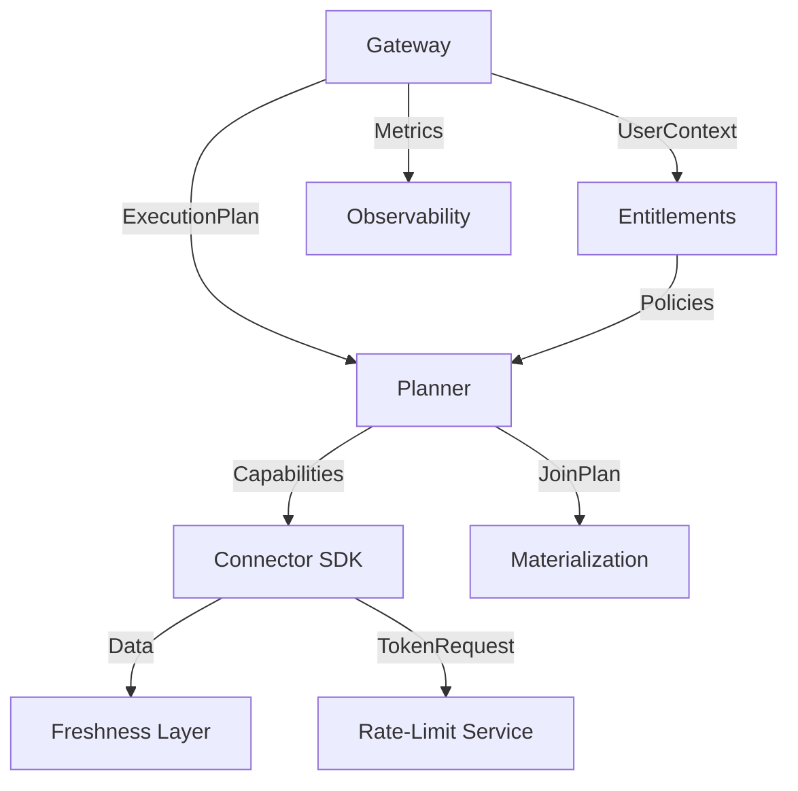

# OmniSQL: Production Modular Architecture

This document outlines the production-ready modular structure for OmniSQL, showing how the prototype's simplified implementation maps to a scalable, enterprise-grade architecture.

---

## Directory Structure

```
omnisql/
├── gateway/                    # Query Gateway
│   ├── __init__.py
│   ├── server.py              # FastAPI application
│   ├── auth.py                # OIDC integration (Auth0, Okta)
│   ├── middleware.py          # Request shaping, timeouts, CORS
│   └── routes/
│       ├── query.py           # POST /v1/query
│       └── health.py          # Health checks
│
├── planner/                    # Query Planner
│   ├── __init__.py
│   ├── optimizer.py           # Cost-based query optimization
│   ├── capability.py          # Connector capability discovery
│   ├── pushdown.py            # Predicate/column pushdown logic
│   ├── join_strategy.py       # On-the-fly vs materialization decision
│   └── sql_parser.py          # SQL AST parsing (sqlglot/sqlparse)
│
├── entitlements/               # Entitlement Service
│   ├── __init__.py
│   ├── service.py             # Main entitlement orchestrator
│   ├── opa_client.py          # OPA policy engine client
│   ├── rls_engine.py          # Row-Level Security enforcement
│   ├── cls_engine.py          # Column-Level Security & masking
│   └── policies/
│       ├── rls/               # RLS policy definitions (YAML/Rego)
│       └── cls/               # CLS policy definitions
│
├── connectors/                 # Connector SDK
│   ├── sdk/
│   │   ├── __init__.py
│   │   ├── base.py            # BaseConnector abstract class
│   │   ├── auth.py            # OAuth2/API key token refresh
│   │   ├── pagination.py      # Cursor/offset pagination handlers
│   │   ├── retry.py           # Exponential backoff & circuit breaker
│   │   └── errors.py          # Standardized error codes
│   ├── github/
│   │   ├── __init__.py
│   │   ├── connector.py       # GitHub-specific implementation
│   │   └── schema.py          # Table/field definitions
│   ├── jira/
│   │   ├── __init__.py
│   │   ├── connector.py
│   │   └── schema.py
│   ├── salesforce/
│   ├── slack/
│   └── registry.py            # Dynamic connector registration
│
├── governance/                 # Rate-Limit Service
│   ├── __init__.py
│   ├── rate_limiter.py        # Token bucket implementation
│   ├── budget.py              # Tenant/user budget allocation
│   ├── concurrency.py         # Concurrency pool management
│   └── async_overflow.py      # Async job queue for overflow
│
├── freshness/                  # Freshness Layer
│   ├── __init__.py
│   ├── cache.py               # Redis/Memcached TTL cache
│   ├── etag.py                # Conditional request handling
│   ├── staleness.py           # Per-source staleness contracts
│   └── incremental.py         # Incremental snapshot logic
│
├── materialization/            # Materialization Engine
│   ├── __init__.py
│   ├── engine.py              # DuckDB/ClickHouse orchestrator
│   ├── lifecycle.py           # TTL-based cleanup (≤ N minutes)
│   ├── encryption.py          # Tenant-scoped KMS encryption
│   └── storage.py             # Parquet on S3/GCS
│
├── catalog/                    # Metadata Catalog
│   ├── __init__.py
│   ├── metadata.py            # Postgres ORM (SQLAlchemy)
│   ├── schemas.py             # Schema registry
│   ├── tenants.py             # Tenant configuration
│   ├── policies.py            # Policy storage
│   └── migrations/
│       └── versions/          # Flyway/Alembic migration scripts
│
├── secrets/                    # Secrets & Keys
│   ├── __init__.py
│   ├── vault_client.py        # HashiCorp Vault integration
│   ├── kms.py                 # AWS KMS / GCP KMS / Azure Key Vault
│   ├── rotation.py            # Automated key rotation
│   └── break_glass.py         # Emergency access protocols
│
├── observability/              # Observability
│   ├── __init__.py
│   ├── tracing.py             # OpenTelemetry trace setup
│   ├── metrics.py             # Prometheus metrics registry
│   ├── logging.py             # Structured logging (JSON)
│   └── dashboards/
│       ├── grafana/           # Grafana dashboard definitions
│       └── alerts/            # Prometheus alert rules
│
├── deployment/                 # Deployment & IaC
│   ├── terraform/
│   │   ├── vpc.tf
│   │   ├── eks.tf
│   │   ├── rds.tf
│   │   └── vault.tf
│   ├── helm/
│   │   ├── omnisql/
│   │   │   ├── Chart.yaml
│   │   │   ├── values.yaml
│   │   │   └── templates/
│   └── docker/
│       ├── Dockerfile.gateway
│       ├── Dockerfile.planner
│       └── Dockerfile.worker
│
└── tests/
    ├── unit/
    ├── integration/
    └── load/
        └── k6_scenarios/
```

---

## Module Responsibilities

### 1. Query Gateway (`gateway/`)
**Purpose**: Face of the system; handles all incoming requests.

**Responsibilities**:
- AuthN via OIDC (Auth0, Okta, custom)
- AuthZ via policy engine (OPA)
- Request validation & shaping
- Timeout enforcement
- Response formatting with metadata (`freshness_ms`, `rate_limit_status`, `trace_id`)

**Key Interfaces**:
```python
# gateway/server.py
@app.post("/v1/query")
async def execute_query(request: QueryRequest, user: User = Depends(authenticate)):
    # Orchestrate: Planner → Entitlements → Execution
    pass
```

**Prototype Mapping**: `prototype/main.py`

---

### 2. Query Planner (`planner/`)
**Purpose**: Intelligence layer; optimizes federated queries.

**Responsibilities**:
- SQL parsing & AST generation
- Connector capability discovery
- Predicate/column pushdown optimization
- Join strategy selection (on-the-fly vs materialization)
- Cost estimation & freshness hints

**Key Interfaces**:
```python
# planner/optimizer.py
class QueryOptimizer:
    def optimize(self, sql: str, user_context: dict) -> ExecutionPlan:
        # Returns optimized plan with pushdown filters
        pass
```

**Prototype Mapping**: `prototype/engine.py` (simplified, hardcoded query)

---

### 3. Entitlement Service (`entitlements/`)
**Purpose**: Security engine; enforces RLS/CLS.

**Responsibilities**:
- Merge source permissions (e.g., GitHub Teams) with tenant policies
- Compute RLS filters at plan time
- Apply CLS masking/blocking rules
- Policy compilation into query predicates

**Key Interfaces**:
```python
# entitlements/service.py
class EntitlementService:
    def apply_rls(self, connector: str, data: List[dict], user: dict) -> List[dict]:
        pass
    
    def apply_cls(self, connector: str, data: List[dict], user: dict) -> List[dict]:
        pass
```

**Prototype Mapping**: `prototype/utils/security.py`

---

### 4. Connector SDK (`connectors/sdk/`)
**Purpose**: SaaS interface abstraction.

**Responsibilities**:
- Capability model (tables, fields, operations, limits)
- Auth/token refresh (OAuth2, API keys)
- Pagination handling (cursor, offset)
- Concurrency contracts
- Standardized error codes

**Key Interfaces**:
```python
# connectors/sdk/base.py
class BaseConnector(ABC):
    @abstractmethod
    def fetch_data(self, query: dict) -> List[dict]:
        pass
    
    def get_capabilities(self) -> ConnectorCapabilities:
        pass
```

**Prototype Mapping**: `prototype/connectors/base.py`, `prototype/connectors/github.py`, `prototype/connectors/jira.py`

---

### 5. Rate-Limit Service (`governance/`)
**Purpose**: Governance & cost control.

**Responsibilities**:
- Token bucket per connector/tenant/user
- Concurrency pool management
- Budget allocation & tracking
- Async overflow path for rate-limited requests

**Key Interfaces**:
```python
# governance/rate_limiter.py
class RateLimitService:
    def consume(self, connector: str, tenant: str, user: str) -> bool:
        pass
    
    def get_status(self) -> dict:
        pass
```

**Prototype Mapping**: `prototype/governance/rate_limit.py`

---

### 6. Freshness Layer (`freshness/`)
**Purpose**: Data latency management.

**Responsibilities**:
- TTL-based caching (Redis/Memcached)
- Conditional requests (ETag, If-Modified-Since)
- Incremental snapshots
- Per-source staleness contracts

**Key Interfaces**:
```python
# freshness/cache.py
class FreshnessCache:
    def get(self, key: str, max_staleness_ms: int) -> Optional[dict]:
        pass
    
    def set(self, key: str, value: dict, ttl: int):
        pass
```

**Prototype Mapping**: Embedded in `prototype/connectors/base.py` (`get_data` method)

---

### 7. Materialization (`materialization/`)
**Purpose**: Compute layer for complex joins.

**Responsibilities**:
- Short-lived table creation (DuckDB/ClickHouse)
- Lifecycle management (TTL ≤ N minutes)
- Tenant-scoped encryption
- Parquet export to S3/GCS

**Key Interfaces**:
```python
# materialization/engine.py
class MaterializationEngine:
    def create_temp_table(self, data: pd.DataFrame, tenant: str) -> str:
        # Returns table_id with TTL
        pass
    
    def cleanup_expired(self):
        pass
```

**Prototype Mapping**: `prototype/engine.py` (DuckDB in-memory)

---

### 8. Metadata Catalog (`catalog/`)
**Purpose**: Persistence layer for system metadata.

**Responsibilities**:
- Schema registry (Postgres)
- Tenant configuration
- Policy storage
- Migrations via Flyway/Alembic

**Key Interfaces**:
```python
# catalog/metadata.py
class MetadataCatalog:
    def get_schema(self, connector: str) -> dict:
        pass
    
    def get_policies(self, tenant: str) -> List[Policy]:
        pass
```

**Prototype Mapping**: Not implemented (in-memory only)

---

### 9. Secrets & Keys (`secrets/`)
**Purpose**: Security core for credentials.

**Responsibilities**:
- HashiCorp Vault integration
- Cloud KMS (AWS/GCP/Azure)
- Tenant-scoped key management
- Automated rotation
- Break-glass protocols

**Key Interfaces**:
```python
# secrets/vault_client.py
class VaultClient:
    def get_secret(self, path: str) -> str:
        pass
    
    def rotate_key(self, tenant: str):
        pass
```

**Prototype Mapping**: Not implemented (hardcoded tokens)

---

### 10. Observability (`observability/`)
**Purpose**: Telemetry & monitoring.

**Responsibilities**:
- OpenTelemetry trace instrumentation
- Prometheus metrics (query latency, connector errors)
- Structured logging (JSON)
- Exemplar-linked dashboards
- Proactive alerts

**Key Interfaces**:
```python
# observability/tracing.py
class TracingService:
    def start_span(self, name: str) -> Span:
        pass
    
    def record_metric(self, name: str, value: float, labels: dict):
        pass
```

**Prototype Mapping**: `prototype/main.py` (Prometheus metrics)

---

## Migration Path: Prototype → Production

### Phase 1: Core Refactor (Week 1-2)
1. Split `main.py` → `gateway/` module
2. Split `engine.py` → `planner/` + `materialization/`
3. Extract `security.py` → `entitlements/`

### Phase 2: Infrastructure (Week 3-4)
4. Add `catalog/` with Postgres
5. Add `secrets/` with Vault
6. Add `freshness/` with Redis

### Phase 3: Production Hardening (Week 5-6)
7. Implement `planner/sql_parser.py` (replace hardcoded queries)
8. Add `governance/async_overflow.py`
9. Add `observability/` full stack (Grafana, alerts)

### Phase 4: Deployment (Week 7-8)
10. Containerize each module (separate Dockerfiles)
11. Create Helm charts
12. Deploy to staging EKS cluster

---

## Interface Contracts

### Inter-Module Communication



### Key Data Structures

```python
# Shared across modules
@dataclass
class ExecutionPlan:
    sql: str
    connectors: List[str]
    pushdown_filters: Dict[str, str]
    join_strategy: str  # "on-the-fly" | "materialized"
    estimated_cost: float

@dataclass
class UserContext:
    user_id: str
    role: str
    team_id: str
    pii_access: bool
    tenant_id: str

@dataclass
class ConnectorCapabilities:
    tables: List[str]
    filterable_fields: List[str]
    sortable_fields: List[str]
    rate_limit: int
    supports_pagination: bool
```

---

## Deployment Topology

### Multi-Tenant (Shared Infrastructure)
```
┌─────────────────────────────────────────────┐
│           Load Balancer (ALB)               │
└─────────────────┬───────────────────────────┘
                  │
        ┌─────────┴─────────┐
        │                   │
   ┌────▼────┐         ┌────▼────┐
   │ Gateway │         │ Gateway │
   │  Pod 1  │         │  Pod 2  │
   └────┬────┘         └────┬────┘
        │                   │
   ┌────▼───────────────────▼────┐
   │      Planner Service         │
   └────┬───────────────────┬─────┘
        │                   │
   ┌────▼────┐         ┌────▼────┐
   │Connector│         │Material-│
   │ Workers │         │ization  │
   └─────────┘         └─────────┘
```

### BYOC (Bring Your Own Cloud)
```
Customer VPC
┌─────────────────────────────────────┐
│  ┌──────────────────────────────┐   │
│  │   Data Plane (Customer)      │   │
│  │  - Gateway                   │   │
│  │  - Planner                   │   │
│  │  - Connectors                │   │
│  │  - Materialization           │   │
│  └──────────────────────────────┘   │
└─────────────────────────────────────┘
              │
              │ (Secure Tunnel)
              │
┌─────────────▼───────────────────────┐
│  Control Plane (OmniSQL Managed)    │
│  - Catalog                          │
│  - Secrets                          │
│  - Observability                    │
└─────────────────────────────────────┘
```

---

## Summary

This production structure provides:
- **Clear separation of concerns** across 10 modules
- **Scalable architecture** supporting multi-tenant and BYOC
- **Well-defined interfaces** for inter-module communication
- **Migration path** from the current prototype
- **Deployment flexibility** for various enterprise requirements

The current prototype demonstrates the **core logic** of these modules in a simplified form, proving the feasibility of the architecture while maintaining code clarity for evaluation purposes.
